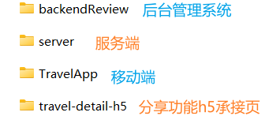

## 项目简介
### 

- 项目分为游记发布、呈现的用户系统和内容合规检查的审核管理系统。  
- 用户系统为一个移动端项目，为乐·游·记 - YouG 旅游平台，可以在手机端发布游记以及查看、分享所有已成功发布的游记；  
- 审核管理系统为一个 PC 站点，不同角色可以对用户发布的游记做上线前的审核检查、删除等操作。

## 文件夹介绍

## 项目启动
### !important 用Expo Go 进行调试,需进行以下操作
- 在TravelApp/src/utils/request.js 里，把baseURL里的地址换成自己电脑的IPV4地址！比如baseURL: 'http://你的IPV4地址:3000/api'

- 详情见每个demo中的README.md

## 常见问题
