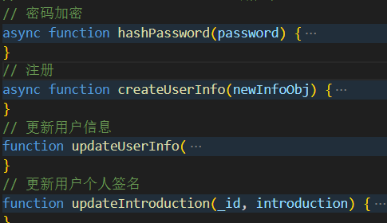
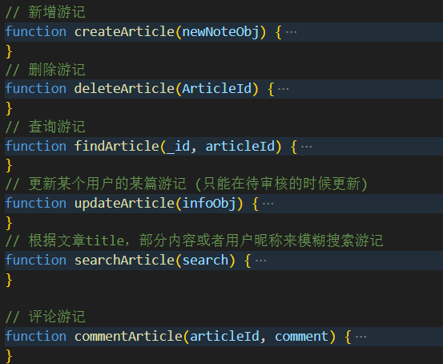
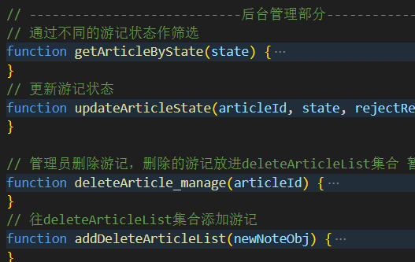

## 服务器（server）

- node.js+Express+MongoDB
- Node.js 是一个开源和跨平台的 JavaScript 运行环境
- express 是一个基于 Noed.js 平台的极简、灵活的 WEB 应用开发框架
- MongoDB 是一个开源的、基于分布式文件存储的数据库管理系统

### app.js (项目入口文件，包含 Express 应用的配置和启动)

1. 配置请求的限制器

```Javascript
 const limiter = rateLimit({
  windowMs: 60 * 1000, // 1分钟
  max: 100, // 最大请求数
  message: '请求过于频繁，请稍后再试！',
  skip: (req, res) => {
    // 可选的条件，用于跳过某些请求，比如管理员或者某些特定的IP
    return false;
  }
});
```

2. 设置请求体大小限制为 100MB

```Javascript
app.use(bodyParser.json({limit: '100mb'}));
app.use(bodyParser.urlencoded({limit: '100mb', extended: true}));
```

3. 解决跨域问题，使用 cors 中间件

```Javascript
const cors = require("cors");
app.use(cors()); //使用cors中间件
```

### server.js(连接 MongoDB 数据库，进行一些配置)

1. 定义模型，使用 mongoose.Schema

   - 用户信息模型`userInfoSchema`以及子模型`articleSchema`
   - 删除的信息模型`deleteArticleSchema`

2. 密码加密

   - 代码如下

   ```Javascript
   async function hashPassword(password) {
   const saltRounds = 10; // 定义加密的复杂度
   try {
       // 生成盐并加密
       const salt = await bcrypt.genSalt(saltRounds);
       const hash = await bcrypt.hash(password, salt);
       return hash; // 返回加密后的密码
   } catch (error) {
       console.error("加密密码时出错:", error);
   }
   return null;
   }
   ```

   - 原理  
     密码哈希的原理是使用密码学中的哈希函数对密码进行转换，使得原始密码无法被逆向解密。bcrypt 是一个常用的密码哈希库，它使用了单向哈希函数和盐的概念来增加密码哈希的安全性。

     盐（Salt）：盐是一个随机生成的字符串，与密码一起被哈希。它增加了密码哈希的随机性和安全性，使得即使相同的密码也会产生不同的哈希值。这样即使两个用户使用相同的密码，其哈希值也会不同，增加了密码泄露后的安全性。

     哈希函数：哈希函数是一种单向函数，它将输入转换为固定长度的输出，且不可逆。这意味着无法从哈希值还原出原始密码。bcrypt 使用了强大的哈希函数来对密码进行处理，使得生成的哈希值具有较高的安全性。

3. 数据库的操作（增删改查）
   方法：

     
     
   

- 创建（Create）：

      插入文档：使用 db.collection.insertOne() 或 db.collection.insertMany() 方法向集合中插入新文档。

      创建文档：在 Mongoose 中，通常是通过模型的 create() 方法创建新的文档。

- 读取（Read）：

      查询文档：使用 db.collection.find() 方法查询集合中的文档。

      获取单个文档：使用 db.collection.findOne() 方法获取满足查询条件的第一个文档。

      按条件查询：可以使用查询条件对象作为参数，也可以使用查询操作符。

      投影：使用第二个参数指定要返回的字段。

      限制结果集：使用 limit() 方法限制返回的文档数量。

- 更新（Update）：

      更新单个文档：使用 db.collection.updateOne() 方法更新满足查询条件的第一个文档。

      更新多个文档：使用 db.collection.updateMany() 方法更新满足查询条件的所有文档。

      替换文档：使用 db.collection.replaceOne() 方法替换满足查询条件的第一个文档。

      使用操作符：可以使用更新操作符如 $set, $unset, $inc 等来更新文档的特定字段。

- 删除（Delete）：

      删除单个文档：使用 db.collection.deleteOne() 方法删除满足查询条件的第一个文档。

      删除多个文档：使用 db.collection.deleteMany() 方法删除满足查询条件的所有文档。

      删除集合：使用 db.collection.drop() 方法删除整个集合。

4. 模糊搜索
includes()方法：用来判断一个数组是否包含一个指定的值
### routes 路由文件夹,包含 Express 路由器，用于定义路由和处理 HTTP 请求。

- users.js App 移动端
- manage.js PC 审核端

1. users.js App 移动端

- 实现了用户注册功能，通过 /register 路由接收用户注册信息，并将信息存储到数据库中（密码会进行哈希加密）。
- 提供了检查用户名是否重复的接口 /checkUsername，用于验证新用户注册时用户名的唯一性。
- 支持用户登录功能，通过 /login 路由接收用户名和密码进行验证，并返回登录成功后的 JWT Token。
  游记管理接口
- 用户可以新增游记，通过 /addTravelNote 路由接收用户提交的游记信息，并将游记信息存储到数据库中。
- 提供了删除游记的接口 /deleteTravelNote，允许用户删除指定的游记，实现了用户物理删除操作。
- 实现了获取游记列表功能，通过 /getAllTravelNote 路由根据用户 ID 或游记 ID 查询用户的所有游记或指定的游记信息。
- 用户可以更新游记信息，通过 /updateTravelNote 路由接收用户提交的游记更新信息，并将更新后的信息存储到数据库中。
- 支持评论游记的功能，通过 /commentTravelNote 路由接收用户提交的评论信息，并将评论添加到相应游记的评论列表中。
- 提供了模糊查询游记的接口 /searchTravelNote，允许用户根据文章标题、部分内容或用户昵称进行模糊搜索游记。

2. manage.js PC 审核端

- 实现了管理员登录功能，通过 /login 路由接收管理员用户名和密码进行验证，并返回登录成功后的 JWT Token。
- 提供了获取不同状态游记列表的接口 /getTravelListByStatus，允许管理员根据游记状态筛选获取相应的游记列表。
- 支持更新游记状态的功能，通过 /updateTravelStatus 路由接收管理员提交的游记状态更新信息，并将更新后的状态存储到数据库中。
- 提供了删除游记的接口 /deleteTravelNote，允许管理员删除指定的游记，并将被删除的游记信息添加到删除游记列表中。

## 旅游日记管理平台（审核端）

### token

- 登录时发请求，后端返回一个 token
- token 的基于 ls 存取删三个方法：`setToken`,`getToken`,`removeToken`,
- store 里的 `initialState` 存储 token
- reducer 封装异步获取 token 的方法
- 高阶组件：`AuthRout` 测试有无组件，放在 Layout 外面

### cookie

- 设置 cookie,项目中为 1 天

```Javascript

  function setCookie(name, value, days) {
    let expires = "";
    if (days) {
      const date = new Date();
      date.setTime(date.getTime() + days * 24 * 60 * 60 * 1000);
      expires = "; expires=" + date.toUTCString();
    }
    document.cookie = name + "=" + (value || "") + expires + "; path=/";
  }
```

- 高阶组件：`LoginRoute`，放在`Login`外面，获取 cookie,如果存在登录标识的 cookie，则说明用户已登录，可以直接跳转到其他页面

### store

- 异步请求，登录时获取 token 和 userInfo

### 转义和反转义

- 代码

```JavaScript
export function escapeHtml(text) {
  const map = {
    "&": "&amp;",
    "<": "&lt;",
    ">": "&gt;",
    '"': "&quot;",
    "'": "&#39;", // 可选
  };
  return text.replace(/[&<>"']/g, function (m) {
    return map[m];
  });
}

// 反转义
export function unescapeHtml(text) {
  const map = {
    "&amp;": "&",
    "&lt;": "<",
    "&gt;": ">",
    "&quot;": '"',
    "&#39;": "'",
  };
  return text.replace(/(&amp;|&lt;|&gt;|&quot;|&#39;)/g, function (m) {
    return map[m];
  });
}
```

## App 移动端

### 瀑布流如何实现？

1. 封装好了`TravelsCard`组件
2. 使用了`waterfall-flow`瀑布流的库，具体实现代码如下：

```Javascript
          <WaterfallFlow
                onRefresh={onRefresh}
                refreshing={isLoading} // 刷新状态
                data={displayedData}
                onEndReached={loadMore}
                onEndReachedThreshold={0.01}
                numColumns={2}
                renderItem={({ item, index, columnIndex }) => (
                  <TravelsCard
                    item={item}
                    key={index}
                    columnIndex={columnIndex}
                  />
                )}
              />
```
3. 设置了第一列和第二列的高度不同，根据`columnIndex`来知道是第几列

### 上传图片如何实现？

- 新建游记列表页面
- 换头像
- 流程：

1. 写好 CSS 布局，将需要上传图片出写选择图片的点击事件，代码如下：
   Expo 里引入了`ImagePicker`，调用了`ImagePicker.launchImageLibraryAsync（）`方法
   设置了媒体类型，是否允许编辑，裁剪比例，图片质量，以及是否返回 base64,会有一个对象，将对象里的 base64 值`setImageList`
   ` result.assets[0].base64`

```Javascript
const pickImage = async () => {
    // No permissions request is necessary for launching the image library
    let result = await ImagePicker.launchImageLibraryAsync({
      mediaTypes: ImagePicker.MediaTypeOptions.All,
      allowsEditing: true, // 是否允许编辑
      aspect: [4, 3], // 裁剪比例
      quality: 0.2, // 图片质量
      base64: true, // 是否返回base64
    });
}
```

2. 使用的时候：从数据库获取图片的 base64,在图片前加上 `data:image/jpeg;base64`
3. 图片上传时的问题，返回413状态码，请求体体积过大：解决方法2个，一是在上传时压缩图片，二是在后端修改请求体体积限制，由默认值改为100M

