# 乐·游·记 - YouG 旅游 App

## 项目简介

用 Expo 搭建的 React Native 旅游日记 App

## 项目启动

- cd TravelApp
- npm start
- Press i // 打开 ios simulator
- 手机下载 expo App，扫描二维码
- `!important`用 Expo Go 进行调试,需进行以下操作
  - 在 TravelApp/src/utils/request.js 里，把 baseURL 里的地址换成自己电脑的 IPV4 地址！比如 baseURL: 'http://你的IPV4地址:3000/api'
  - 分享页面功能的实现：在 TravelApp/src/TravelsDetails/index.js 中，把如下图片地方的 url 换成自己换成自己电脑的 IPV4 地址！比如 baseURL: 'http://你的IPV4地址:5010?articleId=${item.articleId}'  
    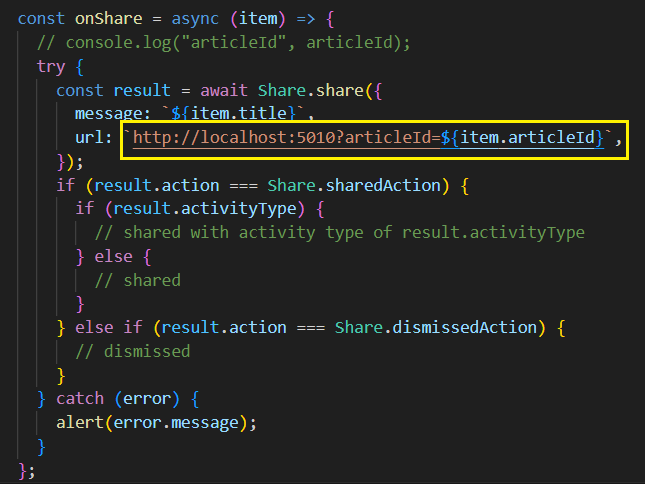

## 技术栈

React Native + Expo + React + Nodejs + MongoDB+Ant Design Mobile RN + react-native-waterfall-flow

## 页面功能说明

### 首页

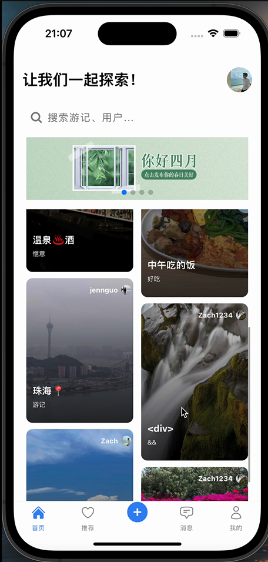

- 页面布局如图所示。
- 页面顶部展示页面标语以及用户头像。
  - 用户未登录时，右上角头像框显示默认头像，点击后可跳转登录&注册页面。
  - 用户注册并登录后，首页右上角头像框会显示当前用户头像，点击可跳转至个人信息页面。
- 搜索功能：用户点击搜索框后，可跳转至搜索页面进行搜索（详细介绍见搜索页）
- 页面中加入广告轮播图，自动播放一些广告。
- 页面主体是瀑布流展示游记区
  - 布局：两列瀑布流，所有用户发布并且后台审核通过的游记会以最新发布时间排序展示在此；
  - 刷新功能：下拉瀑布流区域，可以刷新最新游记数据；
  - 分页加载功能：上滑可以分页加载游记列表，设置为初始加载 4 条游记，后续每次上滑可加载 4 条游记，提高性能。
- 底部是导航栏，底部导航栏可分别跳转至首页、推荐页、游记发布页、消息页以及我的页面。

### 登录页

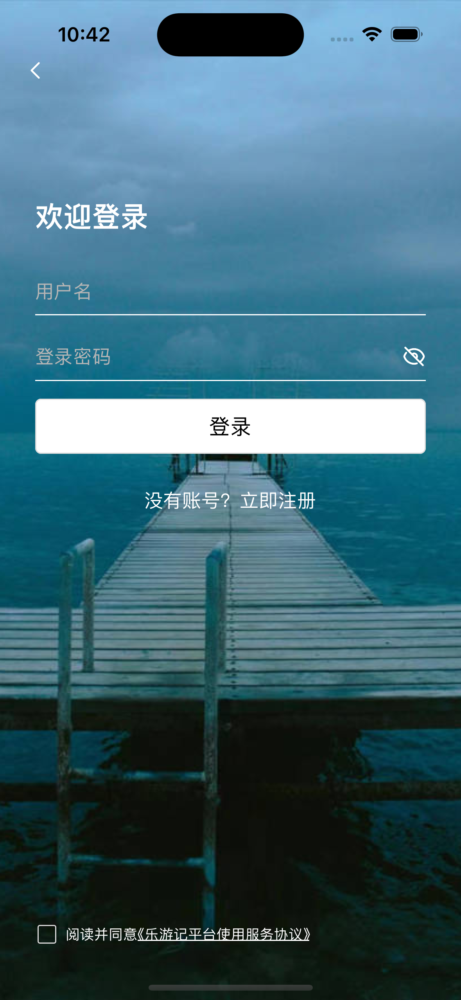

- 登录页主要由 Input 组件、Button 组件、路由组件组成。
- 用户输入账号和密码后，点击登录，会发送登录请求。
- 校验功能：
  - 若后端验证账号密码正确，会返回该用户个人信息 UserInfo 和 Token，个人信息会被存储在「AsyncStorage」中。
  - 若密码错误，则提示“密码错误”。
  - 当用户输入用户名，并且使用户名输入框失去焦点时，（比如点击登录密码时），会进行用户名校验，若该用户名不存在，则会提醒用户，引导用户检查用户名是否正确或者去注册。
- 点击「注册」按钮，跳转到注册页面。

### 注册页

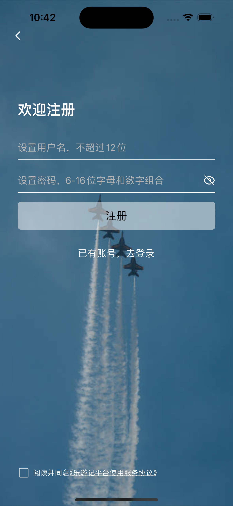

- 注册页主要由 input 组件、button 组件、路由组件组成。
- 注册功能：设置用户名和密码，点击注册，会发送注册请求，注册成功后，会返回成功信息。
- 校验功能：用户名和密码需要符合一定格式，若校验失败，则无法进行注册。
- 注册成功后跳转到登录页。

### 我的页面

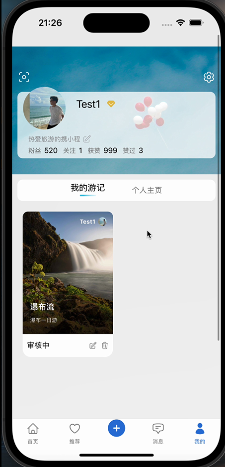
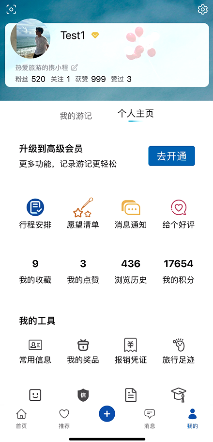

- 页面展示如图所示,未登录和登录时不同。
- 页面顶部为设置 Icon,点击可到达设置页面。
- 页面展示个人信息，包括头像和个签，点击可跳转个人信息修改页。
- 页面主要区域分个人游记和个人主页。
- 个人主页为静态展示区，功能待开发，页面底部可点击进入游记发布页面。
- 个人游记展示当前用户所有游记，状态包括审核中、已通过和未通过。
- 跳转：所有游记点开可跳转至游记详情页。
- 游记状态说明：
  - 审核中状态，审核中的游记可以进行查看、编辑、删除操作。
  - 已通过状态：游记会展示在首页瀑布流区，游记只可查看删除，不可编辑。
  - 未通过状态：可以查看拒绝原因，点击后查看拒绝原因，进行重新编辑。
- 刷新功能：下拉页面可刷新最新数据。
- 游记删除前会弹出确认窗口，增加用户体验。

### 个人信息修改页

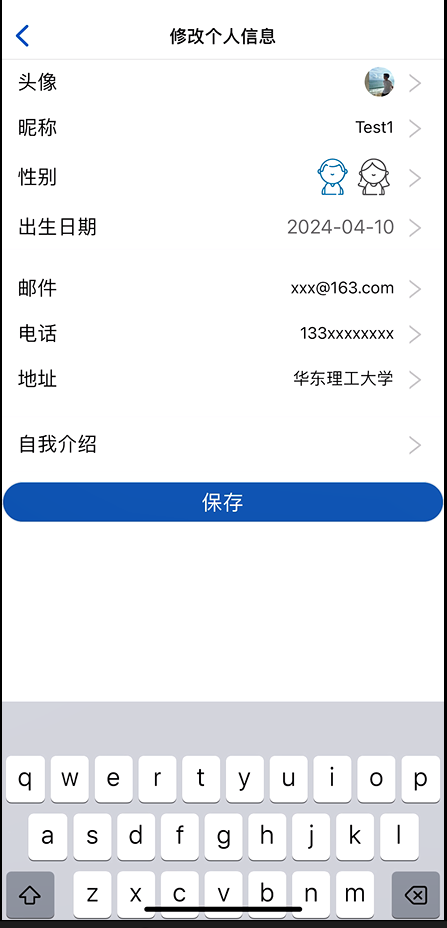

- 在「我的」页面点击头像后跳转，在这里可以修改用户的个人信息，比如头像、昵称、个性签名等。（注：新注册的用户个人信息是系统默认的，需要自行在这里进行修改）
- 修改完对应的简介后，点击保存按钮，更新用户信息。
- 「我的」页面上的「自我介绍」，点击后和「修改简介页面」里的「自我介绍」，点击后均跳转到同一页面。若在「我的」页面进行修改，保存后会直接修改自我介绍；若在「修改简介」里进行跳转修改，保存后会返回「修改简介」页面，在该页面点击保存后，才会更新。

### 搜索页

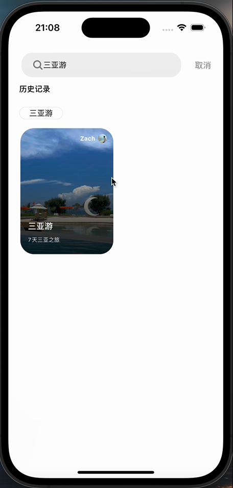

- 从首页点击搜索框，可直接跳转至搜索页面，如图所示。
- 模糊搜索功能：通过游记的标题，正文，以及游记作者等相关不完全信息来搜索相关游记。
- 历史记录功能：搜索栏下方展示历史搜索记录，点击可直接获取到输入框。
- 取消焦点功能：点击取消，返回首页时，为防止默认聚焦到首页搜索框导致又跳转至搜索页所做的优化。
- 点击游记进入该游记详情页。

### 游记详情页

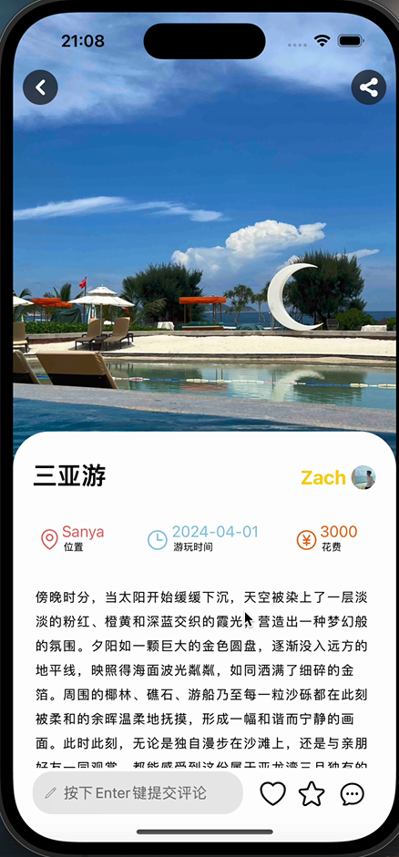
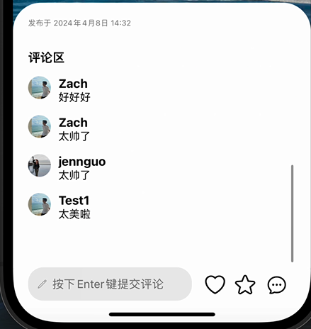

- 进入页面：从首页瀑布流区域，搜索页面游记展示区和我的游记页面，点击游记，展示当前游记详情页面。
- 分享功能：点击分享按钮可以将当前页面分享到微信等平台，目前仅支持 ios 系统。
- 评论功能：页面底部是评论框，用户可以点击输入，按回车发表评论，发表后，评论展示在下方评论区。
- 页面顶部设计：取消路由页的上方返回栏，并在页面左上角和右上角自定义返回和分享按钮。
- 页面上方为图片展示区，使用 Swiper 轮播图组件进行展示，左右可滑动。
- 页面下方为游记文字区，可展示标题、用户名、用户头像、游玩位置、游玩时间、花费、正文和评论区。
- 点击评论 Icon，页面可滚动至评论区，方便用户查看。

### 新建游记页

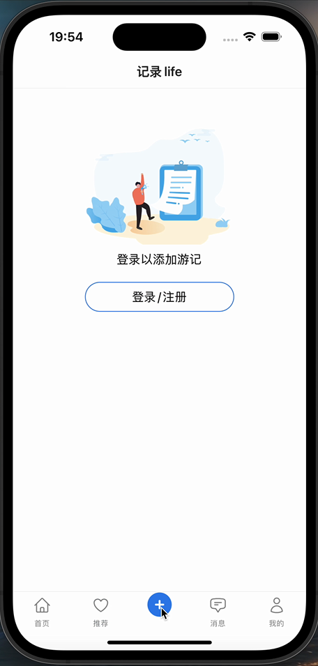
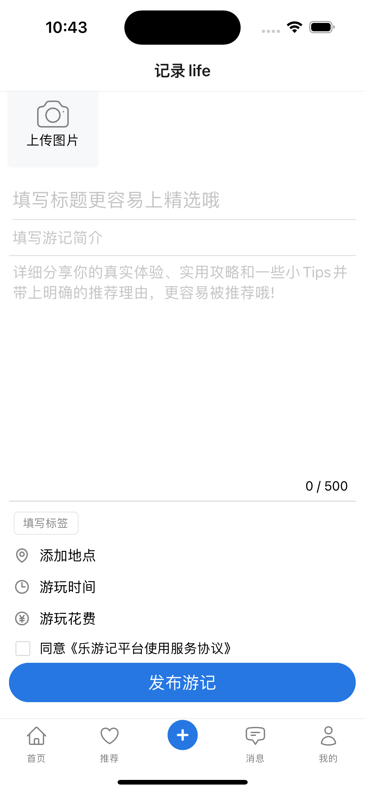

- 未登录时会引导用户进行登录。
- 已登录的用户可以进行新建游记操作。
- 支持用户进行图片上传（最多九图，并支持图片预览）、填写标题、简介、正文、标签、地点、游玩时间、游玩花费等游记信息
- 游记发布成功后跳转「我的」页面，新发布的游记会在「我的游记下面显示」，状态为待审核

### 其他页面

1. 推荐页面  
   

- 如图所示。
- 诚招冠名广告[狗头]。
- 点击跳转「加班开发」页面。

2. 消息页面  
   
   

- 如图所示
- 未登录时和登录时展示不同页面。

3. 加班开发页面  
   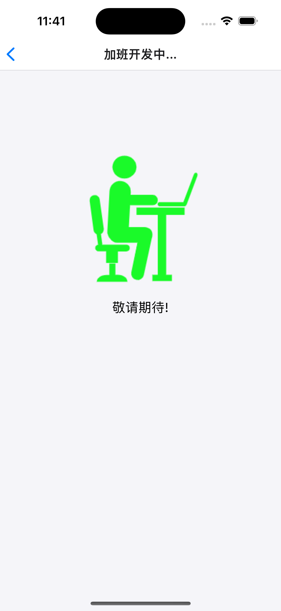
   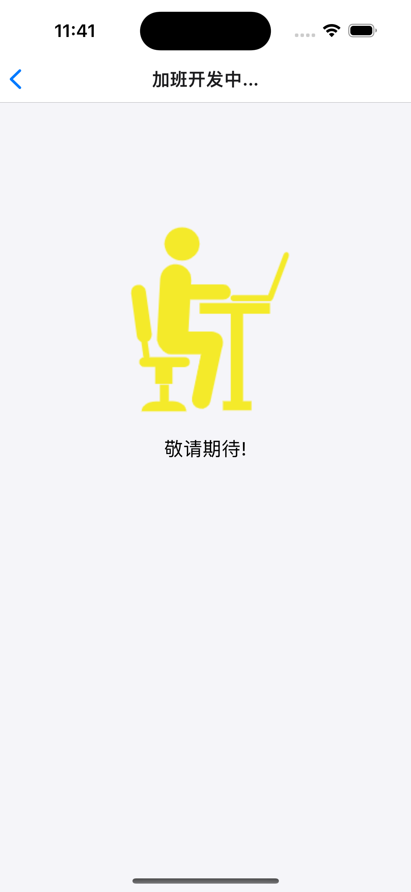

- 如图所示。
- 会变色的加班程序员

4. 用户协议页面  
   

- 如图所示。
- 《乐游记平台使用服务协议》
