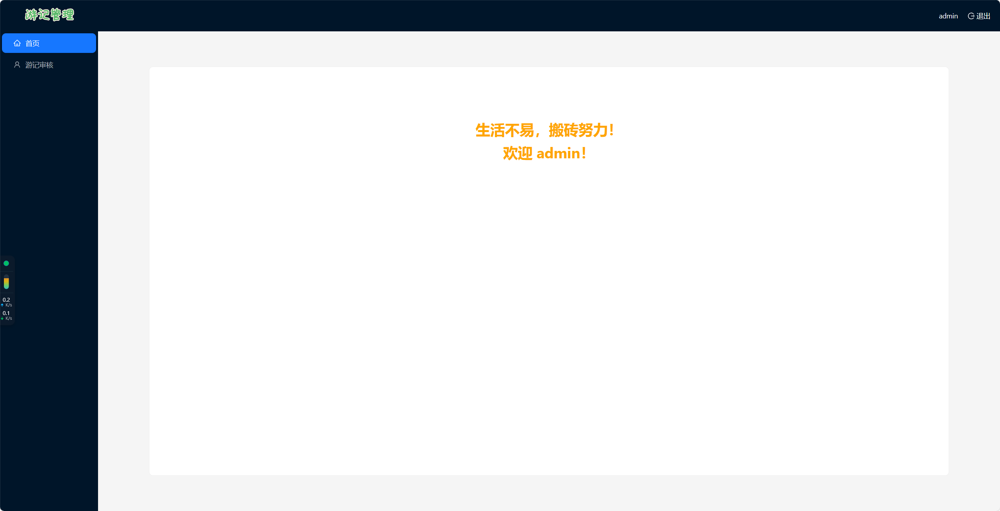

## 项目简介

用 react 搭建的旅游日记管理平台,主要实现对用户发表游记的审核，支持「审核人员」和「管理员」两个角色

## 项目启动

- cd backendReview
- npm i
- npm run dev

## 技术栈

React18 + Vite + React Router 6 + Ant Design

## 功能说明

1. 为简化逻辑，后台审核端账号固定。

   - 审核人员：username&password : user
   - 管理员：username&password：admin

2. 展示所有用户发布的游记列表,包括待审核、已通过、未通过三种状态
   - 审核人员支持对游记进行操作（预览、通过和拒绝）
   - 管理员包括审核员的所有权限，还支持「逻辑删除」某一篇游记。
3. 当拒绝某一篇游记时，需要审核员/管理员填写拒绝原因，该拒绝原因会在用户界面进行展示。

## 页面展示
  

