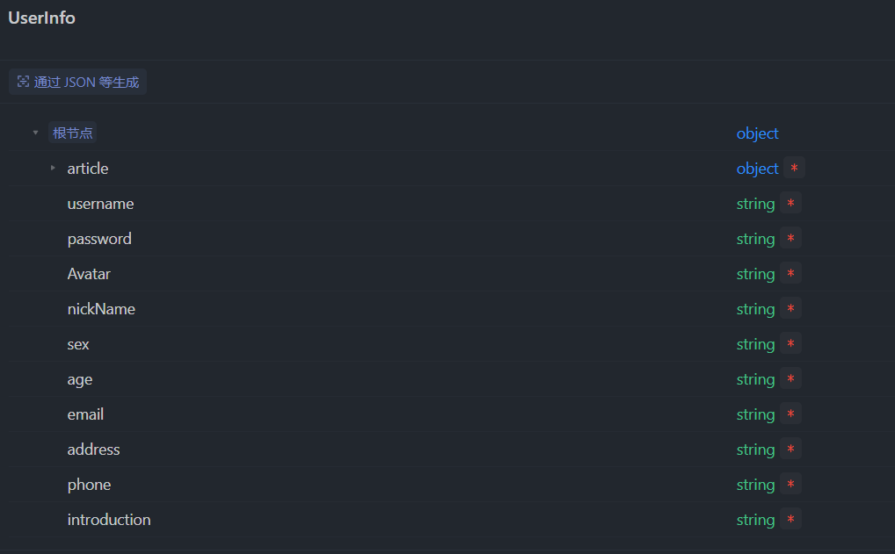
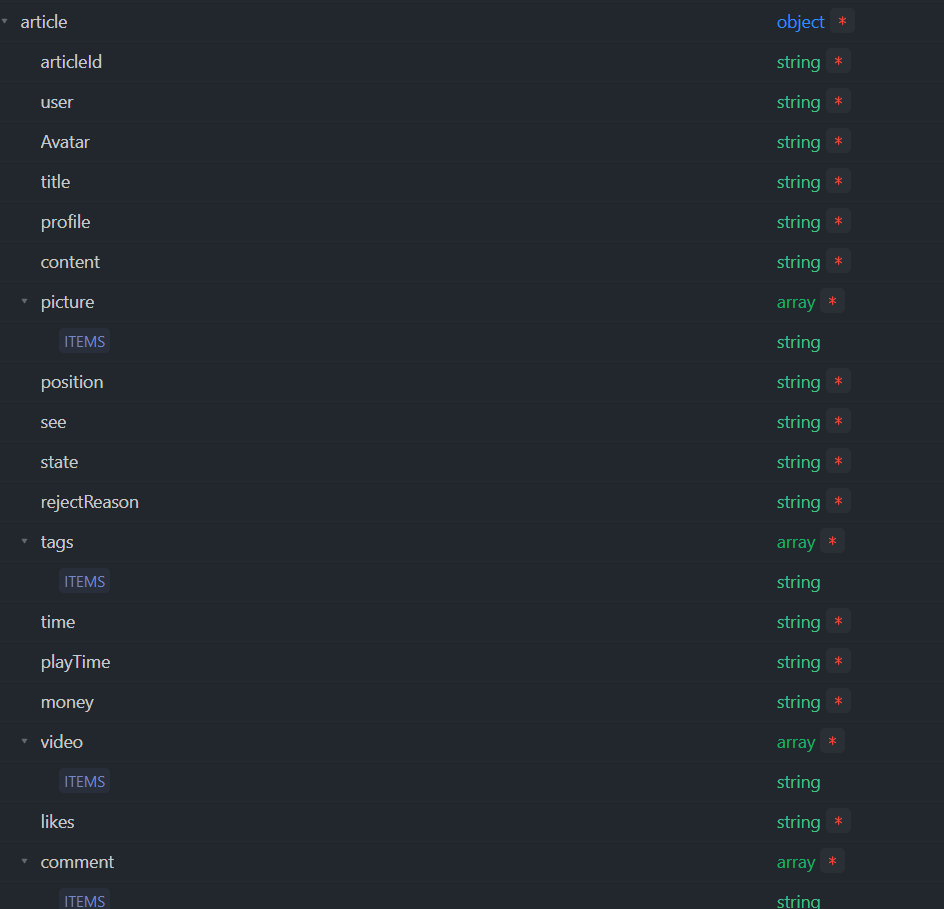
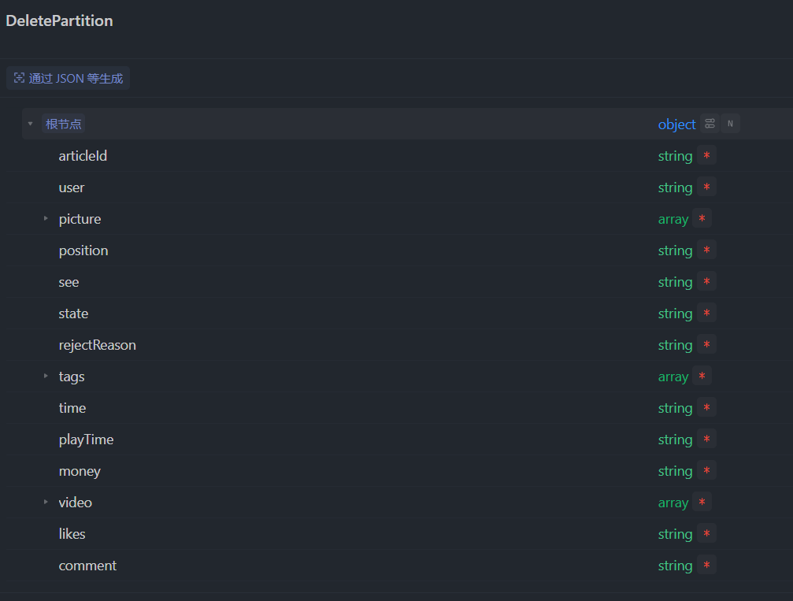

## 项目简介

该项目为后端部分，提供移动端和 PC 审核端所需的接口，并对数据库进行增删改查。接口文档详见'https://apifox.com/apidoc/shared-7a178a43-f478-4187-b72b-0888d3a65a59'

## 项目启动

- cd server
- npm i
- npm start

## 技术栈

node.js+Express+Mongodb

## 功能说明

### 数据结构
- Schema创建了「定义用户信息」和 「储存逻辑删除」的数据模型，其中「定义用户信息」的模型嵌套了「游记」子schema，具体数据结构如下：  
      
      
    

### 用户管理接口

- 实现了用户注册功能，通过 /register 路由接收用户注册信息，并将信息存储到数据库中（密码会进行哈希加密）。
- 提供了检查用户名是否重复的接口 /checkUsername，用于验证新用户注册时用户名的唯一性。
- 支持用户登录功能，通过 /login 路由接收用户名和密码进行验证，并返回登录成功后的 JWT Token。
  游记管理接口
- 用户可以新增游记，通过 /addTravelNote 路由接收用户提交的游记信息，并将游记信息存储到数据库中。
- 提供了删除游记的接口 /deleteTravelNote，允许用户删除指定的游记，实现了用户物理删除操作。
- 实现了获取游记列表功能，通过 /getAllTravelNote 路由根据用户 ID 或游记 ID 查询用户的所有游记或指定的游记信息。
- 用户可以更新游记信息，通过 /updateTravelNote 路由接收用户提交的游记更新信息，并将更新后的信息存储到数据库中。
- 支持评论游记的功能，通过 /commentTravelNote 路由接收用户提交的评论信息，并将评论添加到相应游记的评论列表中。
- 提供了模糊查询游记的接口 /searchTravelNote，允许用户根据文章标题、部分内容或用户昵称进行模糊搜索游记。

### 管理员后台接口

- 实现了管理员登录功能，通过 /login 路由接收管理员用户名和密码进行验证，并返回登录成功后的 JWT Token。
- 提供了获取不同状态游记列表的接口 /getTravelListByStatus，允许管理员根据游记状态筛选获取相应的游记列表。
- 支持更新游记状态的功能，通过 /updateTravelStatus 路由接收管理员提交的游记状态更新信息，并将更新后的状态存储到数据库中。
- 提供了删除游记的接口 /deleteTravelNote，允许管理员删除指定的游记，并将被删除的游记信息添加到删除游记列表中。
