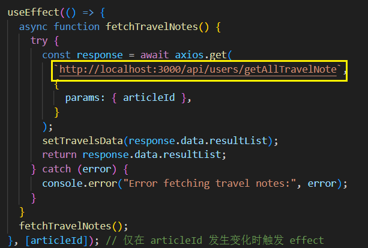
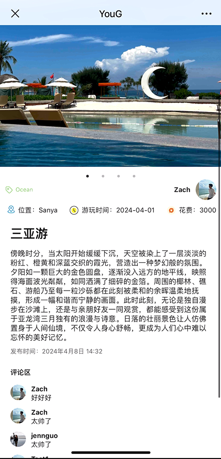

## 项目简介
此项目为移动端app分享功能的h5承接页

## 项目启动
- !important：由于模拟器没有微信，需要用Expo Go 进行调试，需要将在/src/App.jsx如图代码位置，把请求后端的地址换成自己电脑的IPV4地址！比如: 'http://你的IPV4地址:3000/api/users/getAllTravelNote'

- npm i
- npm run build
- npm run serve

## 技术栈
react+ant-design-mobile

## 页面展示

## 功能说明
- 用户从乐·游·记 - YouG App分享游记到微信，在微信里打开后展示了当前游记的详情。
- 页面的顶部图片展示区，使用Slider轮播图组件进行展示，左右可滑动。
- 页面的游记详情展示区，展示发布此篇游记的用户、用户头像以及游记标题、游玩位置、游玩时间、花费、正文和评论区。
- 页面底部是评论框，此处无法进行评论，用户若有评论需求，需要登录App进行评论。
